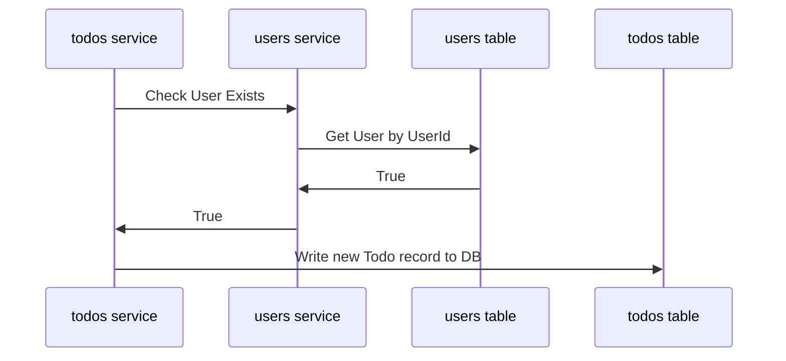

# Chalkboard Demo Todos Microservice

This repository contains the code for the chalkboard_demo_todos project, which consists of the Todos microservice responsible for managing todo-related operations tied to users.

## Table of Contents

- [Technologies Used](#technologies-used)
- [Considerations](#considerations)
  - [Async Operations](#async-operations)
  - [Repository Pattern](#repository-pattern)
- [Directory Structure](#directory-structure)
  - [Todos Service](#todos-service)
- [Setup Instructions](#setup-instructions)
    -[Run Local](#run-local)
    -[Run via Docker](#run-via-docker)
- [cURL Request Examples for Todos](#curl-request-examples-for-todos)
- [Running Tests for Todos](#running-tests-for-todos)

## Technologies Used

The following technologies were used in this project:

- FastAPI
- PostgreSQL
- SQLAlchemy
- Docker
- OpenAPI/Swagger

## Considerations

### Async Operations
- **Improved Performance:** Non-blocking operations allow handling more concurrent requests efficiently.
- **Scalability:** Utilizes server resources better by overlapping tasks and improving CPU and I/O utilization.
- **Responsive Applications:** Ensures applications remain responsive to requests, providing faster responses to clients.

### Repository Pattern

1. **Repository Pattern Overview**
   - Abstracts data access logic, separating it from the application's business logic.
   - Provides centralized access to data, hiding details of data storage, retrieval, and manipulation.

2. **Key Components**
   - **Data Access Abstraction:** Encapsulates logic for CRUD operations, shields the business logic from database specifics.
   - **Separation of Concerns:** Promotes modular and maintainable code by isolating changes in data storage technology or schema.

3. **Implementation Alignment**
   - **Router (Controller) Layer:** Handles HTTP requests, validates inputs, delegates processing to the service layer.
   - **Service (Business Logic) Layer:** Implements application-specific rules, coordinates with repositories for data operations.
   - **Repository (Data Access) Layer:** Manages database interactions, offers a unified interface for data access operations.

    - Repository Pattern: Create User Example


4. **Advantages**
   - **Testability:** Enables independent testing of business logic using mock repositories.
   - **Flexibility:** Minimizes impact of database technology or schema changes by confining them to the repository layer.
   - **Centralized Data Access:** Promotes code reuse, ensures consistent data access patterns across the application.


## Directory Structure

The directory structure of this project is as follows:

### Todos Service

- `repositories/todo_repository.py`: Implements database operations using SQLAlchemy for todos.
- `routers/todo_routes.py`: Defines API routes and endpoints using FastAPI, depending on services for request handling.
- `services/todo_service.py`: Implements business logic and coordinates with repositories for todos.
- `create_db.py`: Script for creating the PostgreSQL database required for the todos service.
- `database.py`: Manages the PostgreSQL database connection.
- `main.py`: Initializes the FastAPI application for todos.
- `models.py`: Defines SQLAlchemy models for todos.
- `schemas.py`: Pydantic schemas for input/output validation related to todos.

## Setup Instructions

### Run Local

To set up and run this project locally, follow these instructions:
    - Note: In order to create and update Todos with an associated UserId, the Users service must also be running

1. Clone each repository and run in dedicated terminals:
    ```sh
    git clone https://github.com/brianroytman/chalkboard-demo-todos.git
    cd chalkboard_demo_todos
    ```
    ```sh
    git clone https://github.com/brianroytman/chalkboard-demo-users.git
    cd chalkboard_demo_users
    ```

2. Install the required dependencies for each service/ in each terminal session:
    ```sh
    pip install -r requirements.txt
    ```

3. Set up the database:
    - Ensure PostgreSQL is running locally or configure connection settings in `.env`.
    - Run the following command to create the database for each each service/in each terminal session:
    ```sh
    py create_db.py
    ```

4. Start the Todos Service:
    - Run the following commands to start the Todos service and the Users service:
    ```sh
    uvicorn main:app --reload --port 8000
    ```
    ```sh
    uvicorn main:app --reload --port 8001
    ```

5. Access the Todo Service API documentation:
    - Open your web browser and go to `http://localhost:8000` to access the Swagger UI documentation and endpoints for the Todos service API.

### Run via Docker

To set up and run this project with Docker, follow these instructions:
- Note: The docker-compose.yml file has configuration details for starting up and connecting to the Users service as well as the Todos service

1. Clone the repository and navigate to the root directory of the project:
```sh
git clone https://github.com/brianroytman/chalkboard-demo-todos.git
cd chalkboard-demo-todos
```

2. Make sure Docker is installed on your machine:

3. Run Docker Compose:
```sh
docker-compose build
docker-compose up
```

4. Access the Todos service and Users in your web browser:
    - Users service must be up and running for Todos.Create and Todos.Update endpoints to function
```sh
http://localhost:8000
http://localhost:8001
```

5. Interact with Users service endpoints via web browser

## cURL Request Examples for Todos
- GET /todos/
```sh
curl -X 'GET' \
    'http://127.0.0.1:8000/todos' \
    -H 'accept: application/json'
```

- POST /todos/
```sh
curl -X 'POST' \
    'http://127.0.0.1:8000/todos' \
    -H 'accept: application/json' \
    -H 'Content-Type: application/json' \
    -d '{
    "title": "Buy groceries",
    "description": "Go to the supermarket and buy groceries",
    "is_completed": false,
    "user_id": 1
}'
```

- GET /todos/{todo_id}
```sh
curl -X 'GET' \
    'http://127.0.0.1:8000/todos/1' \
    -H 'accept: application/json'
```

- PUT /todos/{todo_id}/
```sh
curl -X 'PUT' \
    'http://127.0.0.1:8000/todos/1' \
    -H 'accept: application/json' \
    -H 'Content-Type: application/json' \
    -d '{
    "title": "UPDATE Buy groceries",
    "description": "Go to the supermarket and buy groceries",
    "is_completed": true,
    "user_id": 1
}'
```

- DELETE /todos/{todo_id}/
```sh
curl -X 'DELETE' \
    'http://127.0.0.1:8000/todos/6' \
    -H 'accept: */*'
```

## Running Tests for Todos

To run the tests for this project, use the following commands:

```sh
py -m unittest -v routers/test_routes.py
py -m unittest -v services/test_services.py
py -m unittest -v repositories/test_repository.py
```